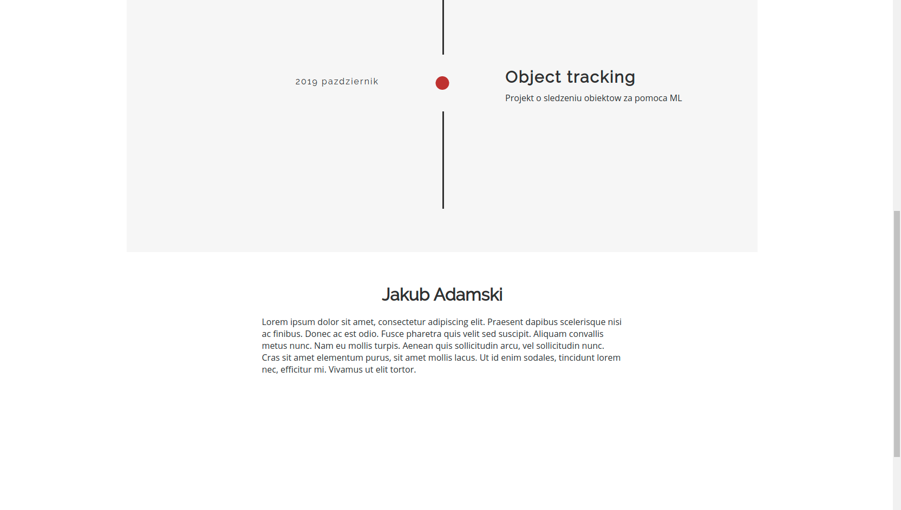
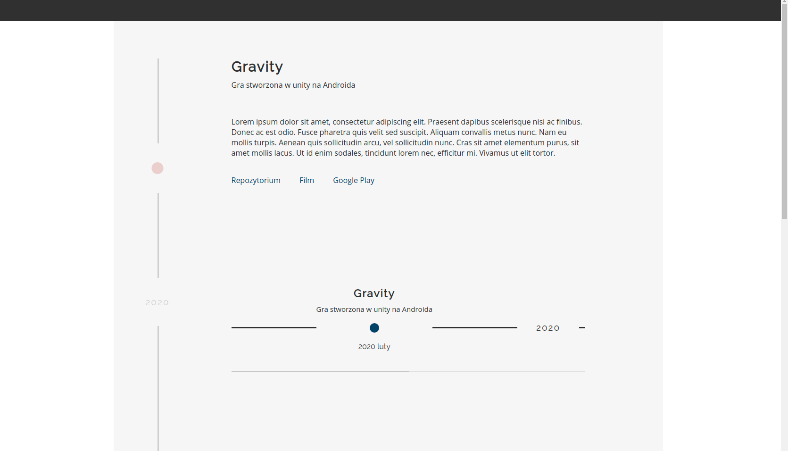

# TL-frontend
Frontend do strony Timeline

## Uruchomienie
Nie wiem czy trzeba instalowac vue cli. Uruchomienie -> w folderze <code>frontend-proj</code> komendy <code>npm run serve</code>

## Co to jest?
Strona umozliwiajaca stworzenie wlasnego portfolio, na podstawie zrealizowanych projektow.  

Istniejące rozwiązania:
- kreatory stron takie jak WordPress - strony dostosowane do twoich potrzeb
- kreatory osi czasu - do robienia timeline np przy projektach itd.
- portale z ogłoszeniami pracy linkedin 

Główne cechy mojej strony:
- oparta na jednym szablonie dla wszystkich - oś czasu na której dodajemy projekty.
- w punktach które dodajemy na oś może być JEDNA dodatkowa oś czasu - sa to szczegóły w danym projekcie
- unifikacja, to co wyróżnia strony użytkowników to tylko treść - czyli nasze zrealizowane projekty
- wyszukiwarka po kategoriach np. informatyka, zdjęcia

Wyróżniki od istniejących rozwiązań
- Kreatory stron - u mnie będzie unifikacja strony - przejrzystość
- Kreatory osi czasu - u mnie focus na ładnie wyglądające portfolio i realizowane projekty
- ogłoszenia pracy - u mnie nie ma ogłoszeń tylko w klarowny sposób prezentują się osoby

Dodatkowe pomysły:
- możliwość tworzenia backupu podawanych stron?

## SC

